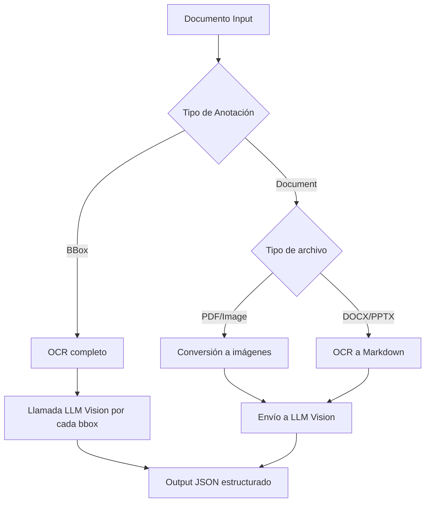

# Mistral Document AI - Annotations API

## Tabla de Contenidos
- [Introducción](#introducción)
- [Tipos de Anotaciones](#tipos-de-anotaciones)
- [Capacidades Principales](#capacidades-principales)
- [Casos de Uso Comunes](#casos-de-uso-comunes)
- [Flujo de Trabajo](#flujo-de-trabajo)
- [Formatos Aceptados](#formatos-aceptados)
- [Implementación](#implementación)
  - [BBox Annotation](#bbox-annotation)
  - [Document Annotation](#document-annotation)
  - [Anotaciones Combinadas](#anotaciones-combinadas)
- [Ejemplos de Salida](#ejemplos-de-salida)

---

## Introducción

La API de Mistral Document AI extiende la funcionalidad básica de OCR añadiendo capacidades de **anotación estructurada**, permitiendo extraer información en formato JSON personalizado según las necesidades del usuario.

Esta funcionalidad convierte documentos no estructurados en datos estructurados mediante esquemas JSON definidos por el desarrollador.

---

## Tipos de Anotaciones

### 1. **BBox Annotation**
Anota elementos específicos extraídos por el OCR (gráficos, figuras, tablas, etc.) según los requisitos del usuario.

**Casos de uso:**
- Descripción/caption de figuras
- Conversión de gráficos a tablas
- Extracción de texto de imágenes específicas
- Identificación de firmas

### 2. **Document Annotation**
Retorna la anotación del documento completo basándose en el formato proporcionado.

**Casos de uso:**
- Extracción de datos de formularios
- Procesamiento de facturas
- Análisis de contratos
- Clasificación de documentos

---

## Capacidades Principales

✅ **Etiquetado y anotación de datos**  
✅ **Extracción estructurada** de información específica en formato JSON predefinido  
✅ **Automatización** de extracción de datos (reduce entrada manual y errores)  
✅ **Procesamiento eficiente** de grandes volúmenes de documentos  
✅ **Manejo de múltiples formatos** (PDF, DOCX, PPTX, imágenes)

---

## Casos de Uso Comunes

### 📄 Procesamiento de Formularios
- Análisis y clasificación de documentos
- Procesamiento de imágenes (texto, gráficos, firmas)

### 📊 Conversión de Datos Visuales
- Gráficos a tablas
- Extracción de texto pequeño de figuras
- Definición de tipos de imagen personalizados

### 🧾 Gestión de Recibos
- Captura de nombres de comerciantes
- Extracción de montos de transacciones
- Automatización de gestión de gastos

### 💼 Procesamiento de Facturas
- Extracción de detalles de proveedores
- Captura de montos y conceptos
- Integración con sistemas contables

### 📋 Análisis de Contratos
- Extracción de cláusulas clave
- Identificación de términos importantes
- Facilitación de revisión y gestión legal

---

## Flujo de Trabajo



### Procesamiento por Tipo

#### **BBox Annotations** (Todos los tipos de documento)
1. Se ejecuta OCR regular
2. Se llama a un LLM Vision para cada bbox individualmente
3. Se aplica el formato de anotación proporcionado

#### **Document Annotation**
**Para PDF/Imágenes:**
- Independiente del OCR
- Todas las páginas se convierten a imágenes
- Se envían todas las imágenes al LLM Vision con el formato de anotación

**Para PPTX/DOCX:**
- Se ejecuta OCR primero
- El output markdown se envía al LLM Vision con el formato de anotación

---

## Formatos Aceptados

| Formato | Soporte | Características |
|---------|---------|-----------------|
| **PDF** | ✅ | OCR completo |
| **Imágenes** | ✅ | Incluso baja calidad o manuscritas |
| **DOCX** | ✅ | Procesamiento de texto y formato |
| **PPTX** | ✅ | Presentaciones con imágenes |
| **Escaneos** | ✅ | Documentos escaneados |

---

## Implementación

### BBox Annotation

#### **Paso 1: Definir el Modelo de Datos**

<details>
<summary><b>Python (Pydantic)</b></summary>

```python
from pydantic import BaseModel, Field

# Modelo básico
class Image(BaseModel):
    image_type: str
    short_description: str
    summary: str

# Modelo con descripciones detalladas
class ImageDetailed(BaseModel):
    image_type: str = Field(
        ..., 
        description="El tipo de imagen (gráfico, tabla, diagrama, fotografía, etc.)"
    )
    short_description: str = Field(
        ..., 
        description="Una descripción breve en español describiendo la imagen"
    )
    summary: str = Field(
        ..., 
        description="Resumen detallado del contenido de la imagen"
    )
```
</details>

<details>
<summary><b>TypeScript (Zod)</b></summary>

```typescript
import { z } from 'zod';

// Modelo básico
const Image = z.object({
  image_type: z.string(),
  short_description: z.string(),
  summary: z.string()
});

// Modelo con descripciones
const ImageDetailed = z.object({
  image_type: z.string().describe("El tipo de imagen"),
  short_description: z.string().describe("Descripción breve de la imagen"),
  summary: z.string().describe("Resumen del contenido de la imagen")
});
```
</details>

<details>
<summary><b>JSON Schema</b></summary>

```json
{
  "type": "object",
  "properties": {
    "image_type": {
      "type": "string",
      "description": "El tipo de imagen"
    },
    "short_description": {
      "type": "string",
      "description": "Descripción breve de la imagen"
    },
    "summary": {
      "type": "string",
      "description": "Resumen del contenido"
    }
  },
  "required": ["image_type", "short_description", "summary"]
}
```
</details>

#### **Paso 2: Realizar la Solicitud**

<details>
<summary><b>Python</b></summary>

```python
import os
from mistralai import Mistral, DocumentURLChunk
from mistralai.extra import response_format_from_pydantic_model

# Configuración
api_key = os.environ["MISTRAL_API_KEY"]
client = Mistral(api_key=api_key)

# Solicitud con BBox Annotation
response = client.ocr.process(
    model="mistral-ocr-latest",
    document=DocumentURLChunk(
        document_url="https://arxiv.org/pdf/2410.07073"
    ),
    bbox_annotation_format=response_format_from_pydantic_model(Image),
    include_image_base64=True
)

# Procesar resultados
for page in response.pages:
    for bbox in page.bboxes:
        if bbox.annotation:
            print(f"Tipo: {bbox.annotation.image_type}")
            print(f"Descripción: {bbox.annotation.short_description}")
            print(f"Resumen: {bbox.annotation.summary}")
            print("---")
```
</details>

<details>
<summary><b>TypeScript</b></summary>

```typescript
import { Mistral } from '@mistralai/mistralai';

// Configuración
const apiKey = process.env.MISTRAL_API_KEY || '';
const client = new Mistral({ apiKey });

// Solicitud con BBox Annotation
const response = await client.ocr.process({
  model: 'mistral-ocr-latest',
  document: {
    documentUrl: 'https://arxiv.org/pdf/2410.07073'
  },
  bboxAnnotationFormat: {
    type: 'json_schema',
    jsonSchema: Image
  },
  includeImageBase64: true
});

// Procesar resultados
response.pages.forEach(page => {
  page.bboxes.forEach(bbox => {
    if (bbox.annotation) {
      console.log(`Tipo: ${bbox.annotation.image_type}`);
      console.log(`Descripción: ${bbox.annotation.short_description}`);
      console.log(`Resumen: ${bbox.annotation.summary}`);
      console.log('---');
    }
  });
});
```
</details>

<details>
<summary><b>cURL</b></summary>

```bash
curl -X POST https://api.mistral.ai/v1/ocr \
  -H "Authorization: Bearer $MISTRAL_API_KEY" \
  -H "Content-Type: application/json" \
  -d '{
    "model": "mistral-ocr-latest",
    "document": {
      "document_url": "https://arxiv.org/pdf/2410.07073"
    },
    "bbox_annotation_format": {
      "type": "json_schema",
      "json_schema": {
        "type": "object",
        "properties": {
          "image_type": {"type": "string"},
          "short_description": {"type": "string"},
          "summary": {"type": "string"}
        },
        "required": ["image_type", "short_description", "summary"]
      }
    },
    "include_image_base64": true
  }'
```
</details>

---

### Document Annotation

#### **Paso 1: Definir el Modelo del Documento**

<details>
<summary><b>Python - Ejemplo: Factura</b></summary>

```python
from pydantic import BaseModel, Field
from typing import List
from datetime import date

class LineItem(BaseModel):
    description: str = Field(..., description="Descripción del producto/servicio")
    quantity: float = Field(..., description="Cantidad")
    unit_price: float = Field(..., description="Precio unitario")
    total: float = Field(..., description="Total de la línea")

class Invoice(BaseModel):
    invoice_number: str = Field(..., description="Número de factura")
    issue_date: date = Field(..., description="Fecha de emisión")
    vendor_name: str = Field(..., description="Nombre del proveedor")
    vendor_rfc: str = Field(..., description="RFC del proveedor")
    customer_name: str = Field(..., description="Nombre del cliente")
    customer_rfc: str = Field(..., description="RFC del cliente")
    line_items: List[LineItem] = Field(..., description="Partidas de la factura")
    subtotal: float = Field(..., description="Subtotal")
    tax: float = Field(..., description="IVA")
    total: float = Field(..., description="Total a pagar")
```
</details>

<details>
<summary><b>Python - Ejemplo: Contrato</b></summary>

```python
from pydantic import BaseModel, Field
from typing import List, Optional
from datetime import date

class Party(BaseModel):
    name: str = Field(..., description="Nombre de la parte")
    role: str = Field(..., description="Rol (Contratante/Contratista)")
    identification: str = Field(..., description="RFC o identificación")

class Clause(BaseModel):
    clause_number: str = Field(..., description="Número de cláusula")
    title: str = Field(..., description="Título de la cláusula")
    content: str = Field(..., description="Contenido de la cláusula")
    key_terms: List[str] = Field(..., description="Términos clave")

class Contract(BaseModel):
    contract_number: str = Field(..., description="Número de contrato")
    contract_date: date = Field(..., description="Fecha del contrato")
    parties: List[Party] = Field(..., description="Partes del contrato")
    object: str = Field(..., description="Objeto del contrato")
    amount: Optional[float] = Field(None, description="Monto del contrato")
    duration: str = Field(..., description="Vigencia del contrato")
    key_clauses: List[Clause] = Field(..., description="Cláusulas principales")
    payment_terms: str = Field(..., description="Condiciones de pago")
```
</details>

#### **Paso 2: Procesar el Documento**

<details>
<summary><b>Python - Procesamiento Completo</b></summary>

```python
import os
from mistralai import Mistral, DocumentURLChunk
from mistralai.extra import response_format_from_pydantic_model

api_key = os.environ["MISTRAL_API_KEY"]
client = Mistral(api_key=api_key)

# Para documentos locales
with open("factura.pdf", "rb") as f:
    document_data = f.read()

response = client.ocr.process(
    model="mistral-ocr-latest",
    document=DocumentURLChunk(
        document_url="url_del_documento"  # o usar document_data para archivos locales
    ),
    document_annotation_format=response_format_from_pydantic_model(Invoice)
)

# Acceder a la anotación del documento
if response.document_annotation:
    invoice = response.document_annotation
    print(f"Factura: {invoice.invoice_number}")
    print(f"Proveedor: {invoice.vendor_name}")
    print(f"Total: ${invoice.total:,.2f}")
    print("\nPartidas:")
    for item in invoice.line_items:
        print(f"  - {item.description}: {item.quantity} x ${item.unit_price} = ${item.total}")
```
</details>

---

### Anotaciones Combinadas

Puedes usar **ambas funcionalidades simultáneamente**:

```python
from pydantic import BaseModel, Field
from typing import List

# Modelo para BBox (imágenes/gráficos)
class Chart(BaseModel):
    chart_type: str = Field(..., description="Tipo de gráfico")
    data_summary: str = Field(..., description="Resumen de los datos")
    key_insights: List[str] = Field(..., description="Insights principales")

# Modelo para el documento completo
class Report(BaseModel):
    title: str
    author: str
    date: str
    executive_summary: str
    conclusions: List[str]

# Solicitud combinada
response = client.ocr.process(
    model="mistral-ocr-latest",
    document=DocumentURLChunk(document_url="url_del_reporte"),
    bbox_annotation_format=response_format_from_pydantic_model(Chart),
    document_annotation_format=response_format_from_pydantic_model(Report),
    include_image_base64=True
)

# Procesar documento
report = response.document_annotation
print(f"Reporte: {report.title}")

# Procesar gráficos
for page in response.pages:
    for bbox in page.bboxes:
        if bbox.annotation:
            print(f"Gráfico encontrado: {bbox.annotation.chart_type}")
            print(f"Insights: {bbox.annotation.key_insights}")
```

---

## Ejemplos de Salida

### Ejemplo: BBox Annotation de Gráfico

**Imagen extraída (base64):**
```json
{
  "image_base64": "data:image/jpeg;base64,/9j/4AAQSkZJRgABAQAAAQABAAD..."
}
```

**Anotación estructurada:**
```json
{
  "image_type": "scatter plot",
  "short_description": "Comparación de diferentes modelos basados en rendimiento y costo.",
  "summary": "La imagen consta de dos gráficos de dispersión que comparan varios modelos en dos métricas de rendimiento diferentes versus su costo. El gráfico izquierdo muestra el rendimiento en MM-MT-Bench, mientras que el gráfico derecho muestra el rendimiento en LMSys-Vision ELO. Cada punto representa un modelo diferente, con el eje x indicando el costo o número de parámetros en miles de millones (B) y el eje y indicando la puntuación de rendimiento. La región sombreada en ambos gráficos destaca la mejor relación rendimiento/costo, con Pixtral 12B posicionado dentro de esta región en ambos gráficos, sugiriendo que ofrece un fuerte balance de rendimiento y eficiencia de costo."
}
```

### Ejemplo: Document Annotation de Factura

```json
{
  "invoice_number": "A-12345",
  "issue_date": "2024-12-15",
  "vendor_name": "Constructora XYZ S.A. de C.V.",
  "vendor_rfc": "CXY123456ABC",
  "customer_name": "CONAGUA",
  "customer_rfc": "CON850101XYZ",
  "line_items": [
    {
      "description": "Suministro de concreto premezclado",
      "quantity": 150.0,
      "unit_price": 2500.0,
      "total": 375000.0
    },
    {
      "description": "Mano de obra especializada",
      "quantity": 80.0,
      "unit_price": 450.0,
      "total": 36000.0
    }
  ],
  "subtotal": 411000.0,
  "tax": 65760.0,
  "total": 476760.0
}
```

---

## Mejores Prácticas

### 🎯 Diseño de Esquemas
- **Sea específico** en las descripciones de los campos
- **Use enums** cuando los valores sean limitados
- **Valide tipos** de datos (fechas, números, strings)
- **Anide objetos** para estructuras complejas

### ⚡ Optimización
- Use `bbox_annotation` solo cuando necesite análisis de imágenes específicas
- Para documentos de texto puro, use `document_annotation`
- Combine ambos cuando el documento tenga texto e imágenes relevantes

### 🔒 Seguridad
- Nunca incluya API keys en el código
- Use variables de entorno para credenciales
- Valide el output antes de usarlo en producción

### 📊 Procesamiento por Lotes
```python
import os
from pathlib import Path

# Procesar múltiples documentos
documents_dir = Path("./documentos")
results = []

for doc_path in documents_dir.glob("*.pdf"):
    with open(doc_path, "rb") as f:
        response = client.ocr.process(
            model="mistral-ocr-latest",
            document=f.read(),
            document_annotation_format=response_format_from_pydantic_model(Invoice)
        )
        results.append({
            "filename": doc_path.name,
            "annotation": response.document_annotation
        })

# Guardar resultados
import json
with open("resultados.json", "w", encoding="utf-8") as f:
    json.dump(results, f, ensure_ascii=False, indent=2, default=str)
```

---

## Recursos Adicionales

- [Documentación Oficial de Mistral AI](https://docs.mistral.ai/)
- [Ejemplos de Esquemas JSON](https://json-schema.org/examples)
- [Pydantic Documentation](https://docs.pydantic.dev/)
- [Zod Documentation](https://zod.dev/)

---

**Nota:** Esta documentación está basada en la API de Mistral Document AI. Verifique siempre la documentación oficial para actualizaciones y cambios en la API.